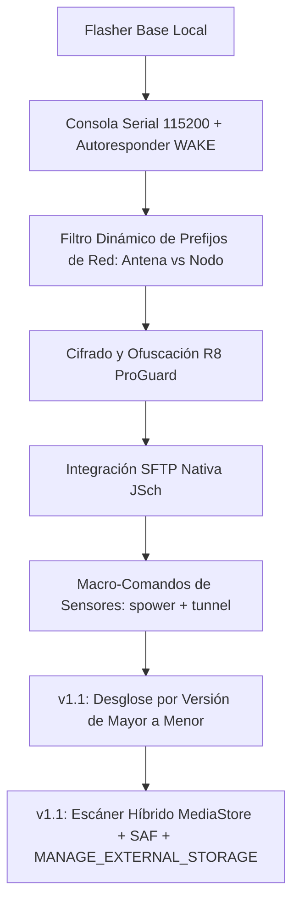

# Especificación Técnica e Historial de Arquitectura: JennicLink Pro v1.1

Este documento recopila la ficha técnica completa del software, las tecnologías utilizadas, dependencias, diseño de arquitectura y su evolución histórica en el proyecto **JennicLink Pro (Versión 1.1)**.

---

## 1. Ficha Técnica General

| Componente | Detalle Tecnológico |
| :--- | :--- |
| **Plataforma Objetivo** | Android 7.0 (API 24) hasta Android 14+ (API 34+) |
| **Lenguaje Principal** | Kotlin (versión JVM Toolchain 17) |
| **Framework de Interfaz** | Jetpack Compose con Material Design 3 |
| **Patrón de Diseño** | MVVM (Model-View-ViewModel) con arquitectura limpia |
| **Seguridad de Código** | Ofuscación y optimización nativa con R8 / ProGuard |
| **Protocolo de Comunicación** | UART/Serial mediante USB Host OTG (115200 / 38400 baudios) |
| **Protocolo de Sincronización** | SSH / SFTP (Puerto 22) y HTTP (Puerto 5000) |
| **Permisos de Almacenamiento** | `MANAGE_EXTERNAL_STORAGE` (Acceso a todos los archivos en Android 11+) y `READ_EXTERNAL_STORAGE` |
| **Hardware Destinatario** | Microcontroladores NXP Jennic JN5168 y JN5169 |

---

## 2. Dependencias y Bibliotecas Utilizadas

Las dependencias clave declaradas en el archivo de compilación [build.gradle.kts](file:///home/innovex/.gemini/antigravity/scratch/jennic_flasher_android/app/build.gradle.kts) son:

1.  **Comunicación Serial (USB OTG)**:
    *   `com.github.mik3y:usb-serial-for-android:3.8.0`
    *   *Uso*: Permite al celular actuar como puerto Host USB para interactuar de forma directa con los chips FTDI, CP210x, CH34x y PL2303 integrados en las placas Jennic y Pancoordinator.
2.  **Cliente SSH/SFTP**:
    *   `com.github.mwiede:jsch:0.2.18`
    *   *Uso*: Proporciona la implementación de sockets seguros para conectar el celular de manera directa a los servidores SSH de las laptops Ubuntu de terreno, permitiendo el escaneo de archivos binarios y su descarga directa.
3.  **Componentes de Arquitectura Android**:
    *   `androidx.lifecycle:lifecycle-viewmodel-compose` (integración de ciclo de vida en Compose).
    *   `androidx.lifecycle:lifecycle-runtime-compose` (recolección de estados asíncronos mediante `StateFlow`).
4.  **Navegación**:
    *   `androidx.navigation3` (arquitectura de navegación por componentes gráficos).

---

## 3. Servidor de Sincronización Local (Python)

Para compatibilidad multiplataforma y entornos donde no hay SSH activo, se programaron dos variantes del servidor de red local:

1.  **Variante Flask**:
    *   *Lenguaje*: Python 3.x
    *   *Librerías*: `Flask` y `CORS`.
    *   *Uso*: Lee el directorio de descargas local, expone la API JSON `GET /api/firmwares` y el flujo binario `GET /api/firmwares/download`.
2.  **Variante Independiente (`simple_server.py`)**:
    *   *Lenguaje*: Python 3 (nativo, sin dependencias externas).
    *   *Librerías*: `http.server`, `json`, `urllib.parse`.
    *   *Uso*: Servidor ligero portátil diseñado para ser copiado en laptops de clientes. Escanea recursivamente las subcarpetas del directorio del usuario buscando archivos `.bin` y los comparte en el puerto 5000.

---

## 4. Evolución Histórica de la Arquitectura de Software

A lo largo del proyecto, la arquitectura del software evolucionó de forma progresiva a través de los siguientes hitos técnicos:



### Paso 1: Motor del Bootloader Jennic
El programador implementa el protocolo de bajo nivel del bootloader Jennic:
*   Envío de cabeceras de sincronización a baudrates específicos.
*   Cálculo de sumas de verificación (checksums).
*   Borrado sectorizado de memoria flash.
*   Escritura secuencial de bloques binarios.

### Paso 2: Optimización del Hilo del Autoresponder WAKE
Originalmente, la respuesta al comando `"wake"` pasaba por el hilo principal de la interfaz de usuario (Main Thread), lo que añadía una latencia superior a 150ms. Esto hacía que el chip Jennic entrara en suspensión antes de recibir la confirmación.
*   *Cambio técnico*: Se aisló la lectura y respuesta serial en una corrutina de Kotlin configurada en `Dispatchers.IO`. El tiempo de respuesta del saludo `"ok\r\n"` se redujo a **menos de 20ms**, manteniendo los nodos encendidos de forma ininterrumpida.

### Paso 3: Configuración Avanzada de ProGuard/R8
Al compilar en modo optimizado de distribución, la herramienta R8 eliminó por error clases criptográficas de la librería `jsch` debido a que estas son invocadas mediante reflexión dinámica.
*   *Solución técnica*: Se crearon reglas estrictas de exclusión y supresión de advertencias en `proguard-rules.pro`:
    ```proguard
    -keep class com.jcraft.jsch.** { *; }
    -keep interface com.jcraft.jsch.** { *; }
    -dontwarn com.jcraft.jsch.**
    -dontwarn org.bouncycastle.**
    -dontwarn org.ietf.jgss.**
    -dontwarn org.newsclub.net.unix.**
    -dontwarn org.slf4j.**
    ```

### Paso 4: Escaneo Recursivo por SSH
El cliente SFTP implementa un método recursivo en `DataRepository` que recorre el disco de la laptop. Para evitar el bloqueo del hilo de red o el desborde de memoria, se implementaron filtros que omiten directorios virtuales y del sistema de Linux:
*   *Directorios excluidos*: `/proc`, `/sys`, `/dev`, `/var`, `/lib`, `/lib64`, `/boot`, `/etc`, `/usr` y carpetas de dependencias de desarrollo como `node_modules`.

### Paso 5: Sincronización Automatizada de Comandos Rápidos
Para la asignación del largo de cable de los sensores, se programó un despachador secuencial que asegura la ejecución consecutiva del protocolo de energía y calibración remota:
1. `spower` (Enciende el bus de energía de los sensores).
2. `tunnel SENS1 cable <largo>` (Configura el parámetro de cable en metros del sensor óptico de oxígeno).
3. `tunnel SENS2 cable <largo>` (Configura el parámetro de cable en metros del sensor de conductividad/salinidad).

### Paso 6: Algoritmo de Extracción y Ponderación de Versiones (v1.1)
Se añadió un sistema de parsing y ordenamiento estricto en `DataRepository.kt`:
* `extractVersionTag(fileName: String)`: Detecta patrones como `v2.0.2`, `v2.0.1`, `v2.0.0`, `r1068`, `r984`.
* `extractVersionWeight(versionTag: String)`: Asigna pesos enteros jerárquicos (ej: `20020` para v2.0.2, `20010` para v2.0.1, `10680` para r1068).
* La interfaz ordena los elementos utilizando `compareByDescending { it.versionWeight }`, dividiendo los grupos mediante separadores visuales `HorizontalDivider` y títulos de categoría.

### Paso 7: Motor de Escaneo Híbrido y Permisos de Almacenamiento (v1.1)
Para garantizar el acceso a archivos de firmware descargados desde navegadores o aplicaciones de mensajería en Android 11+ (API 30+):
* **Gestión de Permisos Runtime**: Si `Environment.isExternalStorageManager()` es `false`, la aplicación redirige al usuario a `Settings.ACTION_MANAGE_APP_ALL_FILES_ACCESS_PERMISSION` para otorgar permiso de administración de archivos.
* **Consulta MediaStore + Fallback ContentResolver**: Explora la base de datos `MediaStore.Files` y realiza la lectura del flujo binario mediante `contentResolver.openInputStream(contentUri)` copiando el archivo a `context.filesDir`.
* **Storage Access Framework (SAF)**: Integración con `ActivityResultContracts.GetContent()` permitiendo la importación directa mediante el explorador nativo de Android.
